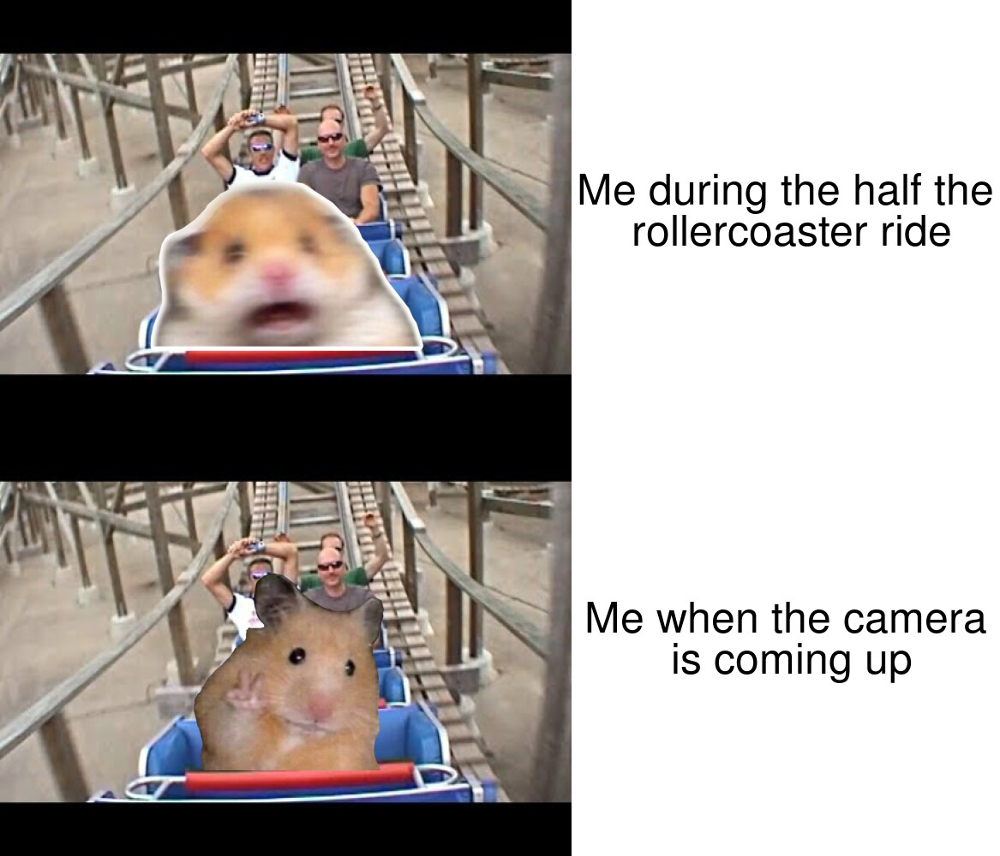

my motiviation to create this meme comes from

```

library(magick)

rollercoaster <- image_read("https://i.ytimg.com/vi/MyzjnbYeecM/hqdefault.jpg") %>%
  image_scale(500)


scared_hamster <- image_read("https://cdn130.picsart.com/325861479094211.png") %>%
  image_scale(350)

scared_hamster_on_rollercoaster <- image_composite(image_scale(rollercoaster, "x500"),scared_hamster, offset = "+150-200")


happy_hamster <- image_read("https://i.pinimg.com/originals/f3/a8/18/f3a8189ab1268d9605d3673b34dd2221.png") %>%
  image_scale (300) %>%
  image_crop("400x240")

happy_hamster_on_rollercoaster <- image_composite(image_scale(rollercoaster, "x500"),happy_hamster, offset = "+200-160")


rollercoaster_text <- image_blank(width = 500,
                                  height = 500,
                                  color = "white") %>%
  image_annotate(text = "Me during the whole\n rollercoaster ride",
                 color = "black",
                 size = 50,
                 font = "Impact",
                 gravity = "center")


camera_text<- image_blank(width = 500,
                          height = 500,
                          color = "white") %>%
  image_annotate(text = "Me when the camera\n is coming up",
                 color = "black",
                 size = 50,
                 font = "Impact",
                 gravity = "center")


top_row <- c(scared_hamster_on_rollercoaster,rollercoaster_text)%>%
  image_append()

bottom_row <- c(happy_hamster_on_rollercoaster,camera_text)%>%
  image_append()

final_meme <- c(top_row,bottom_row)%>%
  image_append(stack = TRUE)

image_write(final_meme, "meme.jpeg")

```
